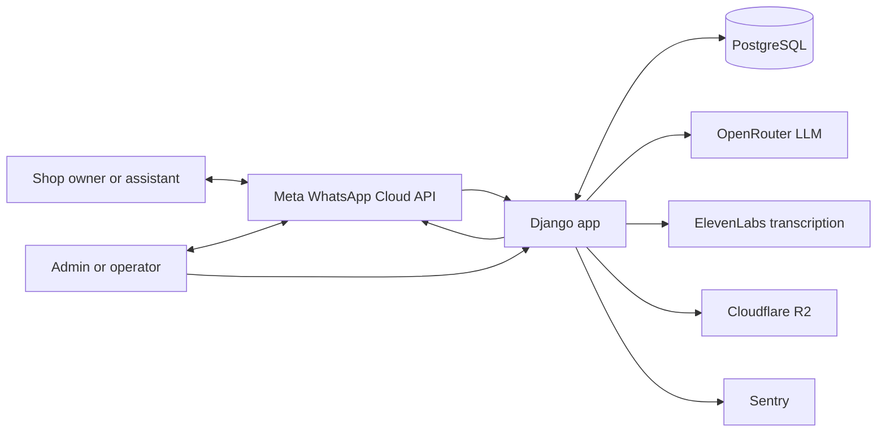
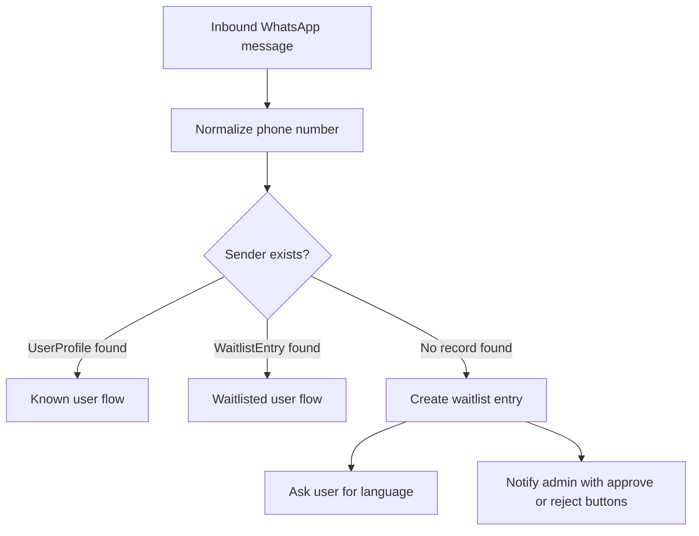
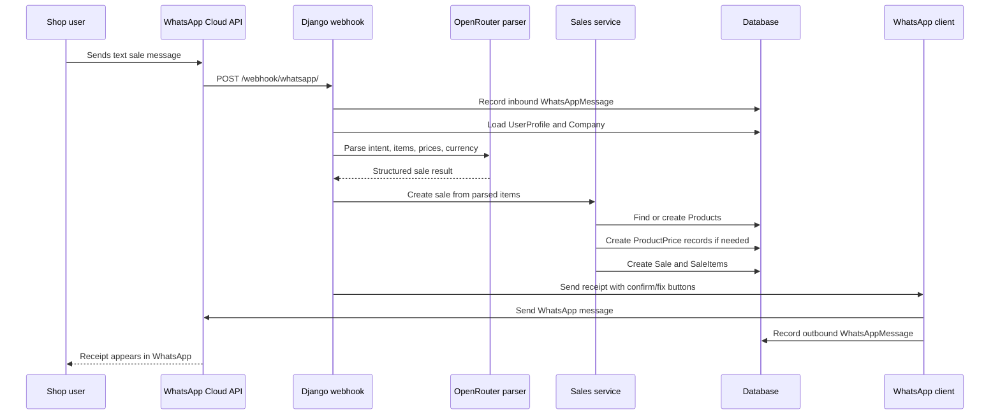
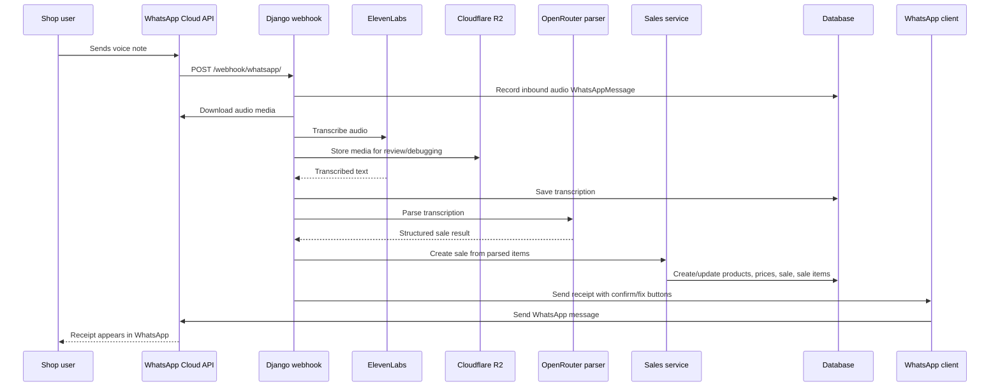
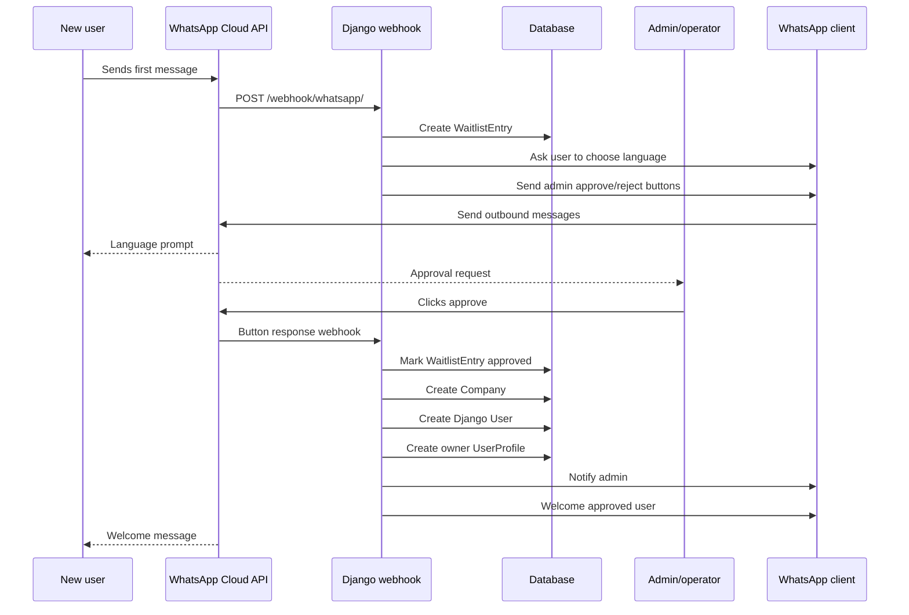
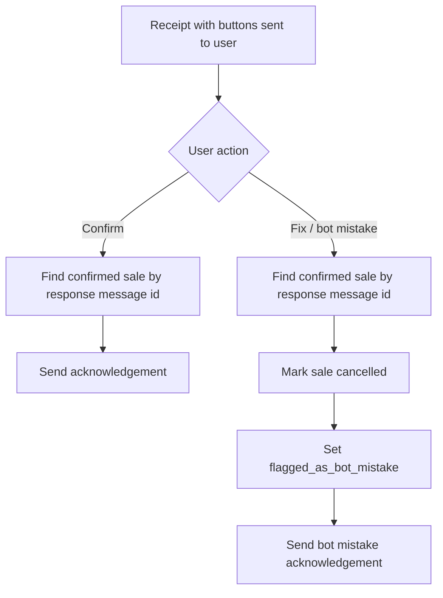
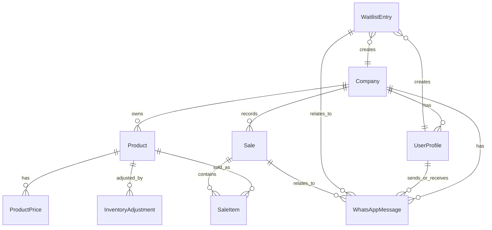
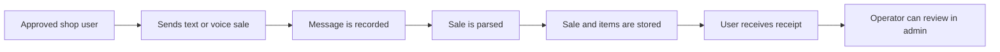

# System Flows

This document uses Mermaid diagrams to show how the main pilot workflows connect.
Keep these diagrams high-level enough to stay useful as implementation details
change.

## System Context

## Sender Routing

Every inbound WhatsApp message first goes through sender lookup. This decides
whether the system should onboard the user, hold them on the waitlist, or process
their message as an approved shop user.

## Text Sale Flow

## Voice Sale Flow

## Waitlist Approval Flow

## Sale Button Flow

## Data Relationships

## Pilot-Critical Path

The most important path to protect for Phase 1 is:

If a proposed change does not improve or protect this path, it should usually go
to the improvement backlog until after the first pilot.
